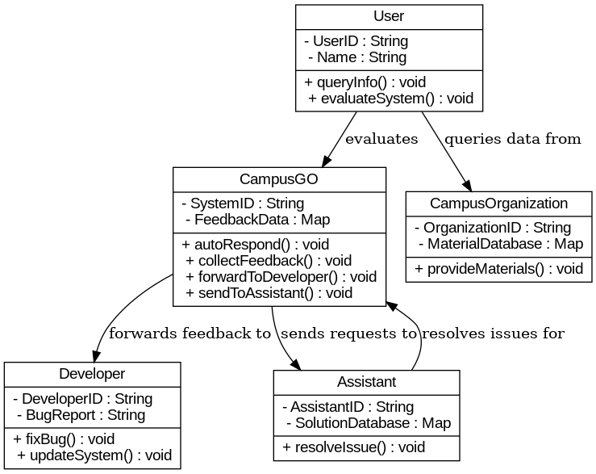

## 第七組
## UML 類別圖

# 生成第二個使用案例的循序圖與活動圖

# 循序圖 2: 選擇項目並回報錯誤
sequence2 = Digraph('Sequence Diagram 2', format='png')
sequence2.attr(rankdir='LR')

sequence2.node('User', shape='rectangle', label='使用者')
sequence2.node('Helper', shape='rectangle', label='小幫手')
sequence2.node('Developer', shape='rectangle', label='開發者')

sequence2.edge('User', 'Helper', label='1. 選擇功能')
sequence2.edge('Helper', 'User', label='2. 發生錯誤，回報訊息')
sequence2.edge('User', 'Helper', label='3. 使用者回報問題')
sequence2.edge('Helper', 'Developer', label='4. 發送錯誤資訊給開發者')
sequence2.edge('Developer', 'Helper', label='5. 修復問題，回傳更新訊息')
sequence2.edge('Helper', 'User', label='6. 通知修復結果')

# 活動圖 2: 選擇項目並回報錯誤
activity2 = Digraph('Activity Diagram 2', format='png')
activity2.attr(rankdir='TB')

activity2.node('Start', shape='circle', label='開始')
activity2.node('SelectOption', shape='rectangle', label='選擇功能')
activity2.node('CheckResult', shape='diamond', label='檢查執行結果')
activity2.node('DisplayError', shape='rectangle', label='顯示錯誤訊息')
activity2.node('ReportError', shape='rectangle', label='回報錯誤資訊')
activity2.node('FixError', shape='rectangle', label='開發者修復問題')
activity2.node('NotifyUser', shape='rectangle', label='通知使用者修復完成')
activity2.node('End', shape='circle', label='結束')

activity2.edge('Start', 'SelectOption')
activity2.edge('SelectOption', 'CheckResult')
activity2.edge('CheckResult', 'DisplayError', label='若失敗')
activity2.edge('DisplayError', 'ReportError')
activity2.edge('ReportError', 'FixError')
activity2.edge('FixError', 'NotifyUser')
activity2.edge('NotifyUser', 'End')
activity2.edge('CheckResult', 'End', label='若成功')

# 渲染圖表並保存
sequence2_path = sequence2.render('/mnt/data/sequence2')
activity2_path = activity2.render('/mnt/data/activity2')

(sequence2_path, activity2_path)
