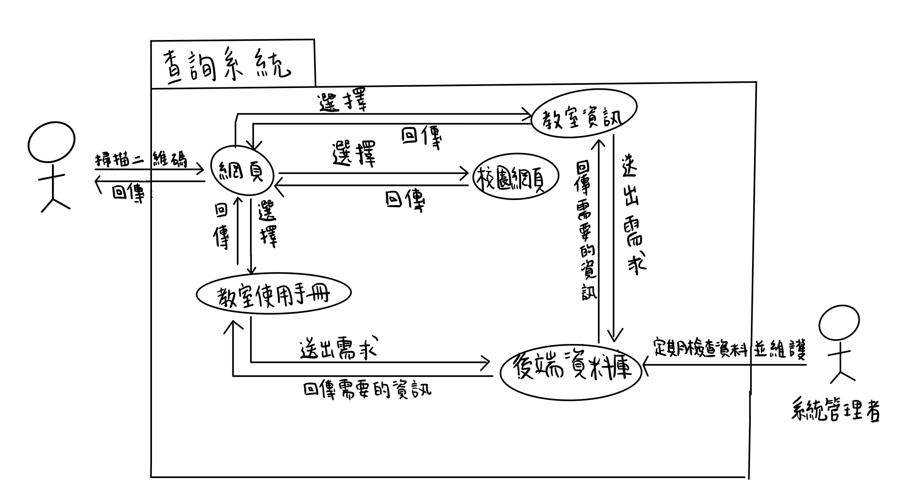

# 校園資訊
利用手機掃描QR-code就能知道一些關於校園的資訊，像是教室此時的授課老師、授課內容、同學名單、電腦如何使用等等，讓您可以快速找到想要的資訊。
## 組員任務
| 組員   | 任務   |
| ------- | ------- | 
| 蔡昀叡   | 程式撰寫   |
| 曾郁璇   | 程式撰寫   | 
| 黃孟婷   | 介面設計   | 
| 張榛芸   | 系統測試   | 
| 謝佳琳   | 系統測試   | 
## 功能性與非功能性需求 hw3 
>功能性需求：
   1. 教室資訊查詢： 使用者掃描教室QR碼後，系統即時顯示當前教室的課程名稱、授課教師、上課時間、課程內容及學生名單
   2. 設備使用說明： 掃碼後可查看教室內所有設備的使用說明，包括電腦、投影儀等，便於使用者操作
   3. 課程資訊管理： 教師可登入後在後台更新課程內容、教室安排及教學設備說明
   4. QR碼生成與管理： 系統為每個教室生成唯一QR碼，並允許下載或打印以便張貼
   5. 用戶權限管理： 使用者（教師/學生）有不同權限，教師能更新課程與設備信息，學生/訪客只能查詢無修改權限 
>非功能性需求：
   1. 即時性： 掃碼查詢教室資訊響應時間應小於1秒，保證即時回應
   2. 易用性： 網站界面簡單明了，確保使用者能輕鬆獲取所需信息
   3. 可靠性： 系統穩定性高，能應對高峰期流量，避免信息丟失或查詢中斷
   4. 可擴展性： 設計上需支持日後擴展，如增添新教室、新課程資訊
   5. 安全性： 學生及教師的敏感數據加密存儲，確保僅授權用戶能訪問
   6. 跨平台支持： 頁面兼容不同設備（手機、平板、電腦），且支持主流瀏覽器訪問
## 使用案例圖 hw3

## 功能分解圖FDD hw3

## 使用案例1：查詢校園頁面

說明：使用者進入網頁後根據自身需求查詢特定校園資訊
主要流程：
1.掃描QR code進入網頁
2.登入後，選擇校園資訊
3.使用者可依照想進一步瞭解之校園資訊選擇功能

例外狀況：登入失敗需重新輸入帳號密碼

## 使用案例2：搜尋教室資訊

說明：使用者必須先掃描二維碼，才能夠登入畫面操作。

主要流程：
1.開相機掃描二維碼
2.登入後，選擇教室資訊的選項
3.在頁面就能查詢所需的資訊

例外情況：
若無法掃描二維碼，可自行輸入二維碼底下的網址

## 使用案例3：查閱使用手冊

說明：使用者可以通過系統查看使用手冊，以了解系統功能或解決使用過程中的問題。

主要流程：
1. 登入系統
使用者進入系統並完成登入。
2. 選擇「使用手冊」
登入成功後，使用者在系統主頁面選擇「使用手冊」選項。
3. 查閱手冊內容
系統顯示手冊內容，使用者可以搜尋或瀏覽手冊，查找相關的指引和解答。
4. 查看詳細內容
使用者選擇手冊中相關的章節或條目，系統顯示詳細的操作說明或解決方案。

例外情況：
無法找到所需內容
若使用者在手冊中無法找到所需的內容，系統可提供「常見問題解答」連結，協助使用者解決疑問。

